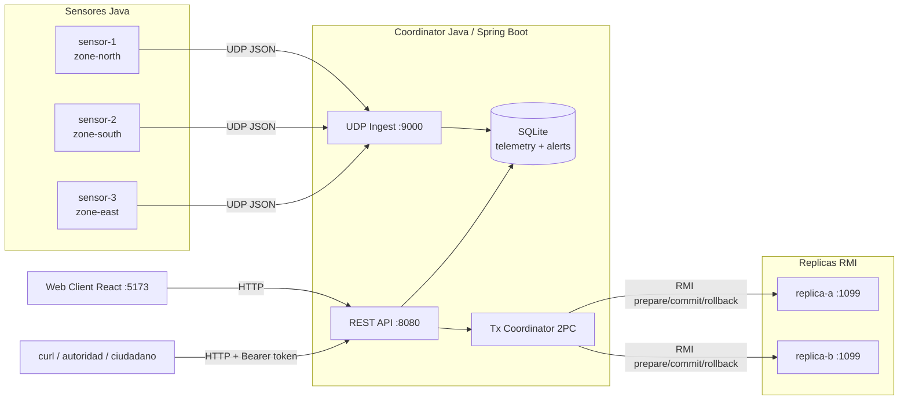
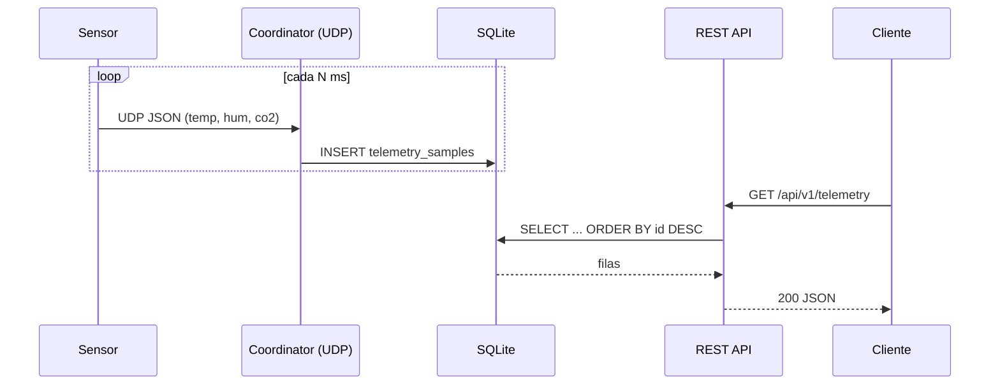
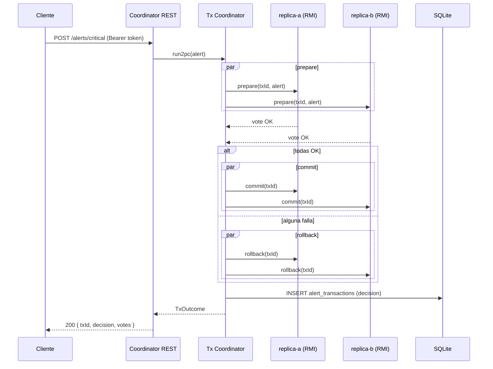

# Red-SensUrb


MVP distribuido (Java + React) para sensores urbanos.

## Qué ya funciona (MVP-1)
- 3 nodos sensor simulados (contenedores Java).
- Envío de telemetría por UDP al coordinator.
- API REST en coordinator:
  - `GET /api/v1/telemetry`
  - `GET /api/v1/nodes/status`
  - `POST /api/v1/alerts/critical` (2PC básico por RMI)
- Réplicas RMI (`replica-a`, `replica-b`) con `prepare/commit/rollback`.
- Web client React mostrando nodos y telemetría.
- Token básico para endpoint crítico.
- Persistencia SQLite para histórico y auditoría de alertas críticas.

## Arquitectura



## Cómo funciona (resumen)

Red-SensUrb simula una red urbana de sensores ambientales distribuidos. El flujo es:

1. **Sensores** (procesos Java independientes) generan lecturas de temperatura, humedad y CO2 cada N milisegundos.
2. Cada lectura se envía como **JSON vía UDP** al `coordinator` (comunicación asíncrona, sin esperar ACK).
3. El **coordinator** (Spring Boot) recibe los datagramas en un listener dedicado, valida, persiste en **SQLite** y actualiza el `lastSeen` del nodo.
4. El cliente (React o `curl`) consulta los datos históricos y el estado de nodos por **REST**.
5. Cuando se dispara una **alerta crítica**, el coordinator ejecuta un **2PC (two-phase commit) simplificado** sobre dos réplicas vía **Java RMI**:
   - `prepare` paralelo en `replica-a` y `replica-b`.
   - Si ambas votan OK: `commit` en ambas.
   - Si alguna falla o hace timeout: `rollback` en ambas.
   - La decisión queda auditada en SQLite.
6. Endpoints sensibles requieren **token Bearer** (autenticación básica).

Esto cubre los requisitos del taller: comunicación síncrona/asíncrona (TCP/UDP), invocación remota (RMI), Web Services (REST), transacciones distribuidas, tolerancia a fallos básica y seguridad por token.

## Video explicativo

Video estilo hypermotion para presentar el proyecto:

[Ver video MP4](./media/redsensurb-hypermotion.mp4)

El render es reproducible con:

```bash
./tools/render_hypermotion_video.sh
```

## Documentación de estudio

La carpeta [`docs/`](./docs) contiene la explicación teórica para estudiar y defender el proyecto:

- [`docs/00-indice.md`](./docs/00-indice.md) — índice de la documentación.
- [`docs/01-arquitectura.md`](./docs/01-arquitectura.md) — componentes, capas y diagramas.
- [`docs/02-flujos.md`](./docs/02-flujos.md) — secuencias de telemetría, estado de nodos y 2PC.
- [`docs/03-pruebas-mvp.md`](./docs/03-pruebas-mvp.md) — cómo levantar y probar paso a paso.
- [`docs/04-api.md`](./docs/04-api.md) — referencia de endpoints REST.
- [`docs/05-defensa.md`](./docs/05-defensa.md) — guía para la presentación/defensa.
- [`docs/06-video-hypermotion.md`](./docs/06-video-hypermotion.md) — guion y notas del video explicativo.

## Estructura del repo
- `backend/` (Maven multi-módulo: `shared-contracts`, `coordinator`, `replica`, `sensor-node`)
- `frontend/web-client/` (React + Vite)
- `deploy/docker-compose.yml`
- `openspec/` (artefactos SDD: proposal, spec, design, tasks)
- `docs/` (documentación de estudio)
- `Makefile` (atajos para Docker y demo)

## Levantar MVP
```bash
make up        # backend distribuido
make demo      # flujo end-to-end automatizado
make help      # ver todos los comandos
```

O sin Makefile:
```bash
docker compose -f deploy/docker-compose.yml up --build
```

## Probar
```bash
curl http://localhost:8080/api/v1/nodes/status
curl "http://localhost:8080/api/v1/telemetry?limit=5"
curl -X POST http://localhost:8080/api/v1/alerts/critical \
  -H "Authorization: Bearer changeme-token" \
  -H "Content-Type: application/json" \
  -d '{"zoneId":"zone-north","metric":"co2Ppm","value":1400,"threshold":1200,"severity":"CRITICAL","source":"demo"}'
curl "http://localhost:8080/api/v1/alerts?limit=10"
```

## Dashboard web

UI gráfica disponible en `http://localhost:5173` (refresh cada 2s).

- **KPIs en vivo**: nodos totales, en línea, lentos/caídos, muestras/min, última alerta.
- **Gráfico temporal multi-zona** con tabs Temp / Humedad / CO₂, ejes, grid y tooltip con crosshair.
- **Grid de nodos** con LED de estado (🟢 <10s · 🟡 <30s · 🔴 >30s), sparkline de temperatura y umbrales coloreados.
- **Timeline de alertas** con severidad codificada (CRITICAL / WARNING / INFO).
- **Composer 2PC**: dispara `POST /api/v1/alerts/critical` con Bearer token (persistido en `localStorage`).
- **Reporte Markdown en vivo** con tabla por zona y nodos con atención.

Variables relevantes:

- `VITE_API_BASE` (frontend, default `http://localhost:8080`).
- `CORS_ALLOWED_ORIGINS` (coordinator, default `*` para dev; usar lista CSV en prod).
- `API_TOKEN` (coordinator, default `changeme-token`).

## Flujo de telemetría



## Flujo de alerta crítica (2PC sobre RMI)



## Más lectura
Ver carpeta [`docs/`](./docs) para profundizar en cada flujo y la guía de defensa.
