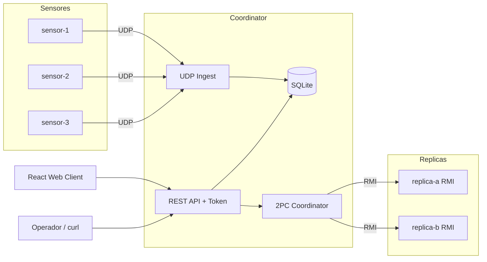
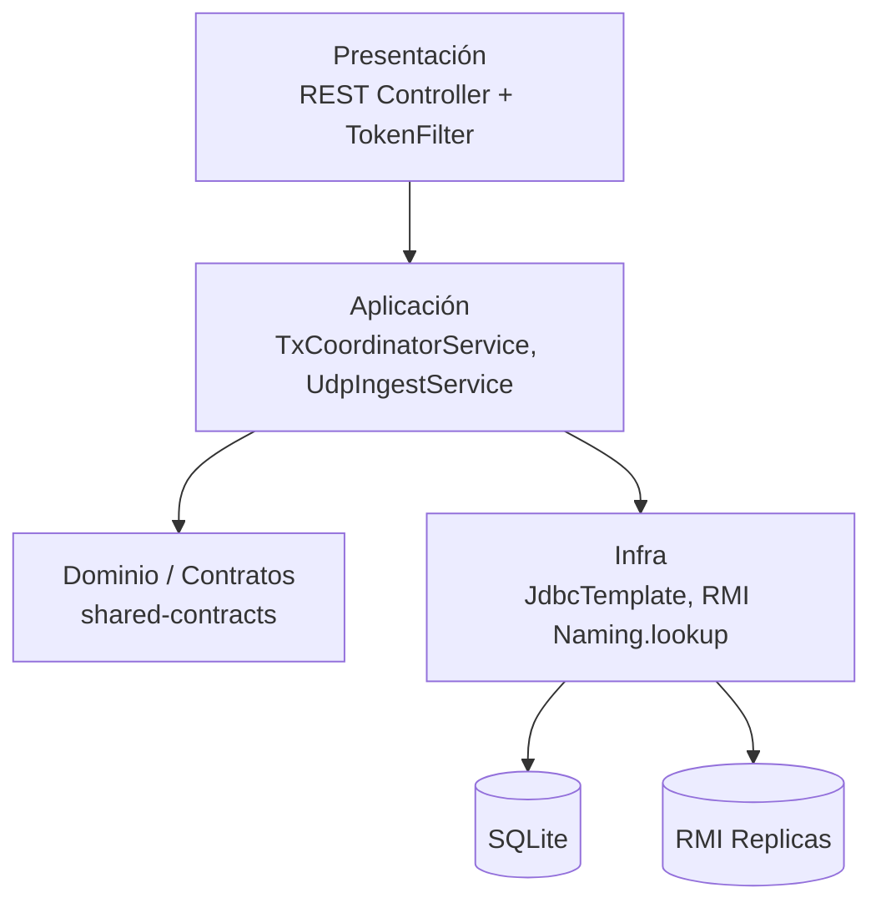

# Arquitectura general

## Diagrama de componentes

## Diagrama de capas (coordinator)

## Componentes
- **sensor-1/2/3 (Java):** generan telemetría y la envían por UDP.
- **coordinator (Java Spring Boot):** recibe telemetría, persiste en SQLite, expone REST y coordina transacciones 2PC por RMI.
- **replica-a / replica-b (Java RMI):** participan de `prepare/commit/rollback`.
- **web-client (React):** muestra nodos y telemetría.

## Protocolos
- **UDP:** sensor -> coordinator (datos ambientales).
- **RMI:** coordinator <-> replicas (transacción crítica distribuida).
- **HTTP REST:** cliente/web/curl -> coordinator.

## Persistencia
- **SQLite en coordinator** (`/data/redsensurb.db` en Docker volume).
- Tablas:
  - `telemetry_samples`
  - `alert_transactions`
