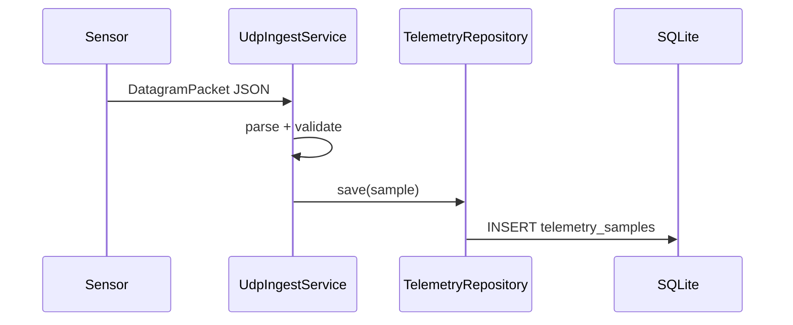
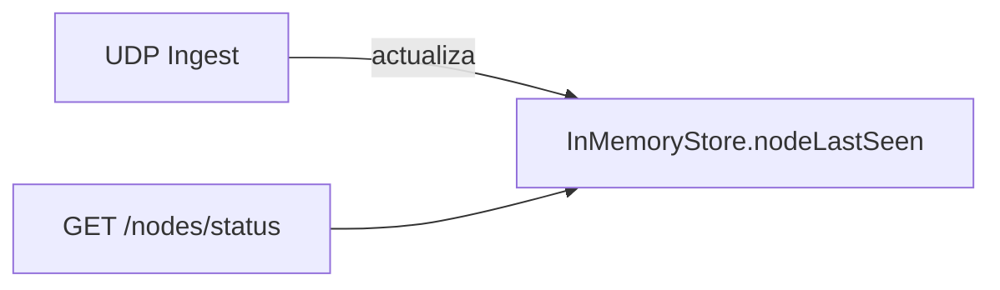
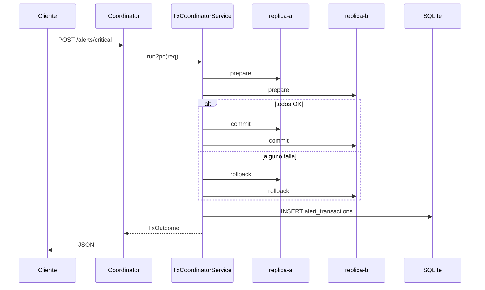

# Flujos clave

## Ingesta de telemetría

## Estado de nodos

## Alerta crítica con 2PC

## 1) Ingesta de telemetría
1. Sensor genera JSON con temp/humedad/co2.
2. Lo manda por UDP al puerto del coordinator.
3. Coordinator parsea JSON y guarda en SQLite.
4. `GET /api/v1/telemetry` devuelve histórico.

## 2) Estado de nodos
1. Cada muestra actualiza `lastSeen` del sensor.
2. `GET /api/v1/nodes/status` muestra heartbeat por nodo.

## 3) Alerta crítica (2PC)
1. Cliente hace `POST /api/v1/alerts/critical` con token.
2. Coordinator crea `txId`.
3. Llama `prepare(txId, alert)` en replica-a y replica-b.
4. Si ambas responden OK -> `commit` en ambas.
5. Si alguna falla -> `rollback` en ambas.
6. Coordinator guarda resultado en SQLite (`alert_transactions`).
